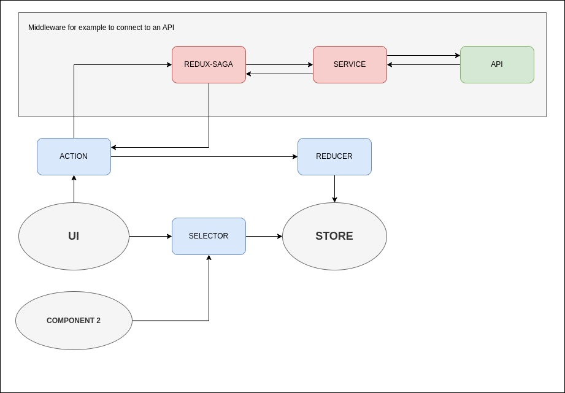

# Introduction

This is a monorepo that has a single package.json for the API and Client.
The idea is as an introduction to [Redux](https://redux.js.org/) and [Redux-saga](https://redux-saga.js.org/), to see how it is handled, so it is perhaps convenient to separate the client from the server.
In this case, an api was used to see an example of the power of redux-saga with asynchronous requests.

## Install

After clone this project you should install the npm packages and bower packages.

    npm install

To run the app you should use this command.

    npm run dev

## Toolkit

Note that `cars` uses [@reduxjs/toolkit](https://redux-toolkit.js.org/) and `users` doesn't, so you can see what it does.

## Architecture

The reducers in both cases use a similar architecture, based on entities.

[ENTITY] example `car` or `user`
- actions * →  This is not necessary, because the toolkit already creates it for you.
- reducer → It is the one that updates the state.
- saga → Middleware, similar in concept to a handler, a function that is executed when an action is executed.
- selector → To get the information of the state.
- index → file to export reducer and saga.

